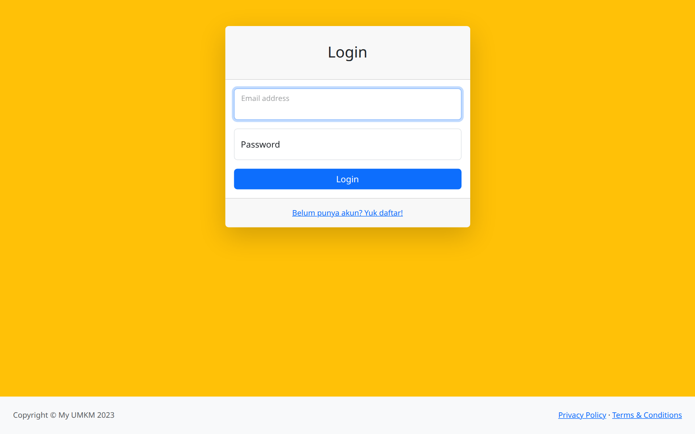
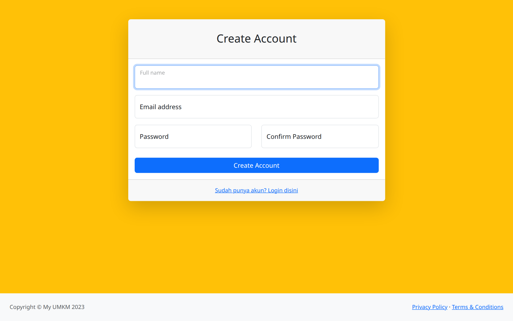

# 🏪 My UMKM

Aplikasi manajemen bisnis & marketplace sederhana untuk UMKM berbasis **Laravel 12**. Pengguna dapat membuka toko, memasarkan produk, dan memproses pesanan dalam satu aplikasi.

## Tampilan

| Login | Register |
|:---:|:---:|
|  |  |

## Fitur

- **Autentikasi** — registrasi & login (Laravel UI + Bootstrap 5)
- **Toko (Store)** — setiap pengguna dapat membuka dan mengelola tokonya
- **Produk** — CRUD produk per toko
- **Keranjang (Cart)** — tambah/hapus produk sebelum checkout
- **Pesanan (Order)** — pembuatan dan pelacakan pesanan
- **Transaksi & Pembayaran** — pencatatan transaksi dan status pembayaran
- **Dashboard** — ringkasan aktivitas toko

## Tech Stack

- Laravel 12 (PHP ≥ 8.2)
- MySQL
- Bootstrap 5 + Bootstrap Icons
- Vite

## Instalasi

```bash
git clone https://github.com/iostream-code/my-umkm.git
cd my-umkm
composer install
npm install && npm run build

cp .env.example .env
php artisan key:generate
# sesuaikan koneksi database (DB_DATABASE, DB_USERNAME, DB_PASSWORD) di .env

php artisan migrate
php artisan serve
```

Buka http://localhost:8000

## Riwayat

Dibangun tahun 2023 dengan Laravel 10; dipugar ke **Laravel 12** (Oktober 2026) — dependensi diperbarui, kompatibel PHP 8.2–8.5, migrasi & test terverifikasi.
