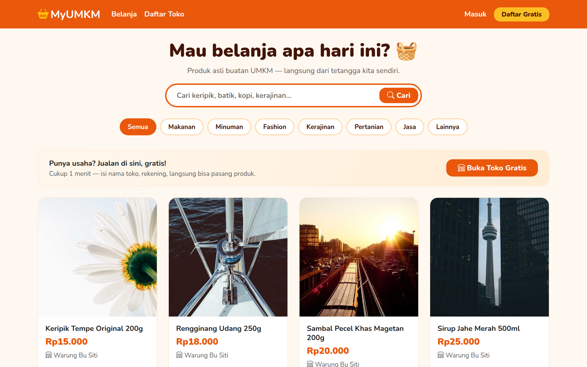
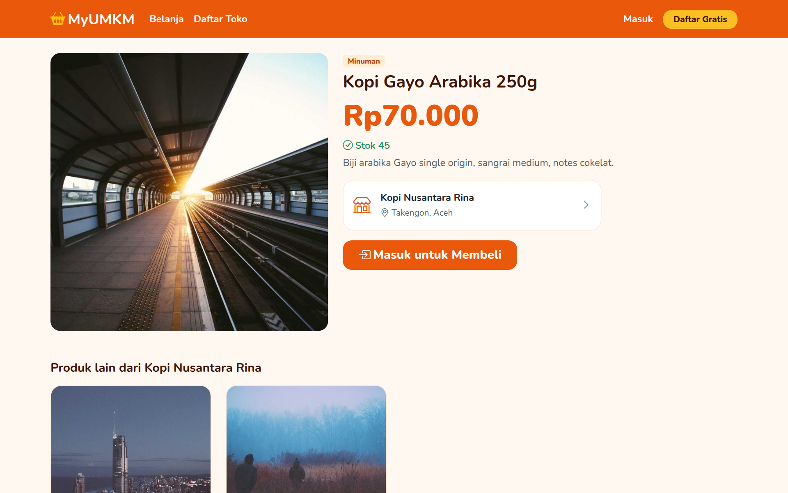
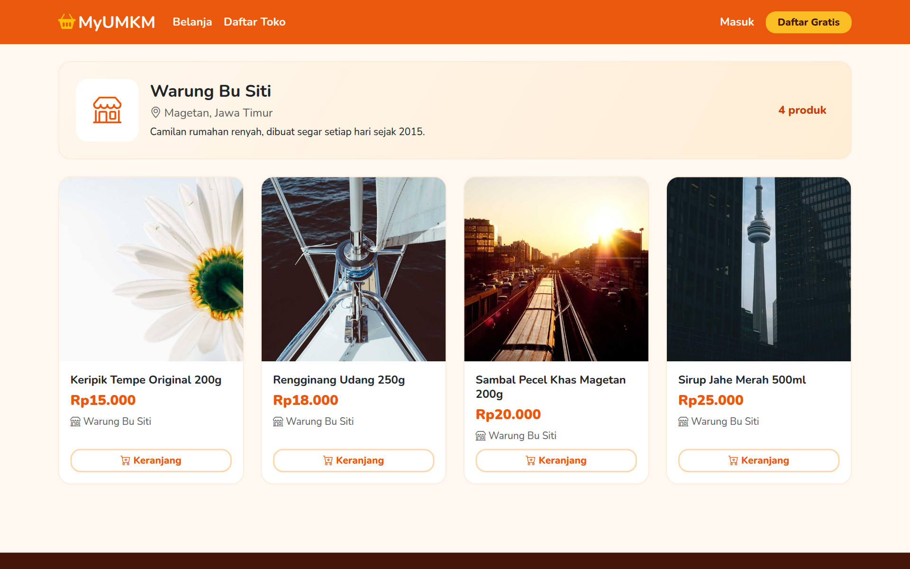
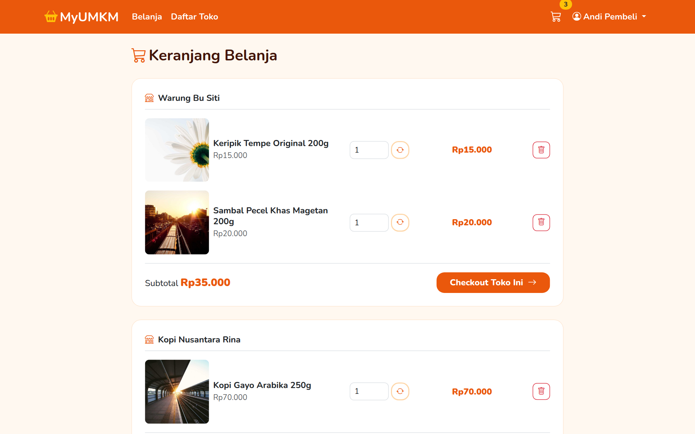
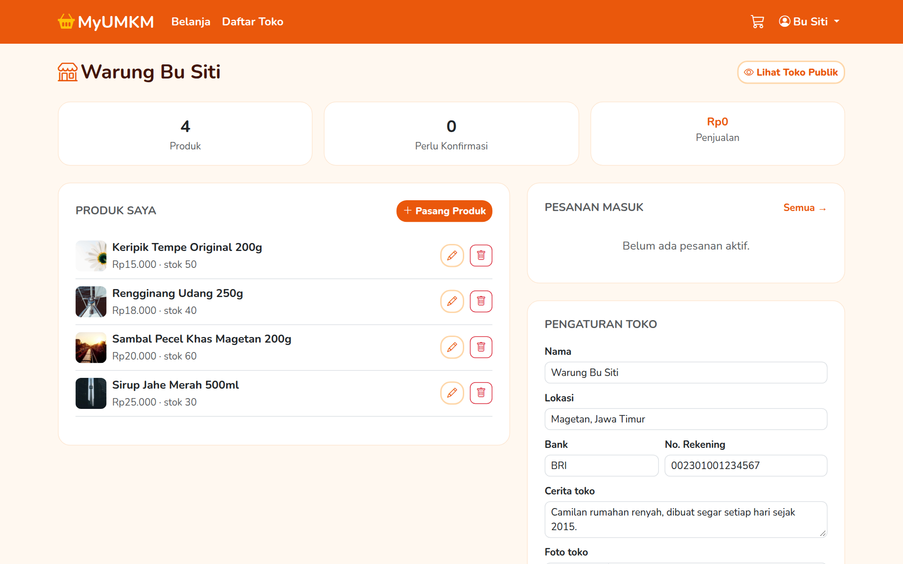

# 🧺 MyUMKM

Marketplace sederhana **dari UMKM, untuk kita semua** — berbasis **Laravel 12**. Setiap orang bisa belanja, dan setiap pelaku usaha bisa **buka toko gratis dalam satu menit**. Didesain *anti-ribet*: tanpa istilah teknis, tombol besar, bahasa sehari-hari, dan nuansa hangat yang mengundang belanja.

## Tampilan

| Beranda (etalase langsung) | Detail Produk |
|:---:|:---:|
|  |  |

| Halaman Toko | Keranjang (per toko) |
|:---:|:---:|
|  |  |

| Dasbor "Toko Saya" |
|:---:|
|  |

## Fitur

**Pembeli**
- Beranda = etalase: pencarian besar, chip kategori, tombol "+ Keranjang" langsung di kartu produk
- Keranjang otomatis **dikelompokkan per toko**; checkout per toko agar pembayaran langsung ke penjual
- Checkout atomik (stok dikunci & dikurangi dalam DB transaction, harga di-snapshot)
- Bayar via transfer ke rekening toko → unggah bukti (otomatis **WebP**, disk privat ber-otorisasi)
- Lacak status pesanan: menunggu pembayaran → konfirmasi → diproses → dikirim → selesai

**Penjual ("Toko Saya")**
- **Buka Toko Gratis**: satu form sederhana (nama, lokasi, rekening) — langsung bisa jualan
- Satu dasbor untuk semuanya: statistik, pasang/ubah produk (foto otomatis WebP), pesanan masuk, konfirmasi pembayaran, pengaturan toko
- Tidak bisa membeli produk toko sendiri; hanya pemilik toko yang bisa mengubah status pesanannya (teruji)

## Tech Stack

Laravel 12 (PHP ≥ 8.2) · MySQL · Bootstrap 5 (tema hangat oranye) · Vite

## Instalasi

```bash
git clone https://github.com/iostream-code/my-umkm.git
cd my-umkm
composer install
npm install && npm run build

cp .env.example .env
php artisan key:generate
php artisan storage:link
# sesuaikan koneksi database di .env

php artisan migrate --seed
php artisan serve
```

**Akun demo** (password `password123`):
`siti@demo.test` (Warung Bu Siti) · `budi@demo.test` (Kriya Kayu) · `rina@demo.test` (Kopi Nusantara) · `andi@demo.test` (pembeli)

## Riwayat

- 2023 — dibangun dengan Laravel 10
- Okt 2026 — dipugar ke Laravel 12
- Okt 2026 — **dirombak total**: tema merakyat oranye, beranda etalase, buka toko 1 menit, checkout per toko dengan stok atomik, bukti bayar WebP privat, dasbor penjual terpadu, 8 test otomatis
